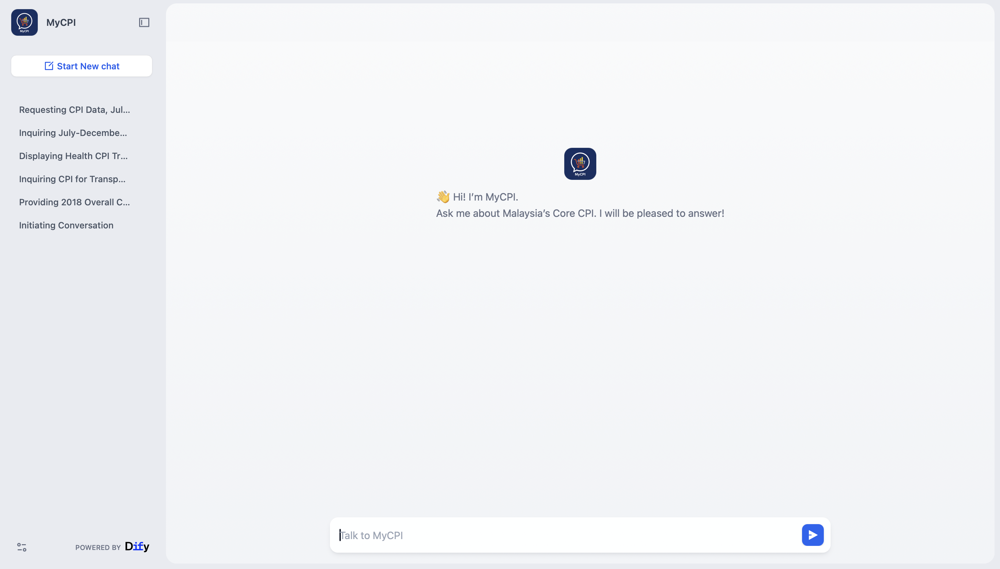

# 📊🛒 MyCPI: An FAQ Chatbot for Exploring Malaysia’s Core Consumer Price Index (CPI)

-orange)

## 🔎 Overview
**MyCPI** is an intelligent **RAG-powered chatbot** that helps users explore Malaysia’s **Core Consumer Price Index (CPI)** data from the **Department of Statistics Malaysia (DOSM)**.  
Built on **Dify AI**, it enables users to ask questions naturally — such as:

- “What’s the CPI for Transport in August 2025?”
- “Show the CPI trend for Health from April to June 2024.”

The chatbot retrieves data directly from the official CPI dataset, analyzes trends, and responds with grounded, citation-based answers.  
It supports **responsible AI principles**, including handling missing or outdated data and refusing unrelated questions.

## 📌 Key Features
- **RAG-Powered Answers** – Combines retrieval and generation for accurate, data-grounded responses.
- **Citations and Transparency** – Every answer includes the official source reference.
- **Range and Trend Queries** – Handles date ranges (e.g., Jan–Jun 2024) and trend analysis.
- **Refusal and Clarification Handling** – Responds responsibly to off-topic or incomplete queries.
- **Dynamic Workflow Design** – Built visually with Dify’s workflow editor (input → retrieval → LLM → response).

## 🧩 Use Cases
- **Researchers & Economists:** Quickly query official CPI trends or divisions.
- **Students:** Understand CPI patterns and how inflation is tracked.
- **Policy Analysts:** Access reliable inflation indicators by category or period.
- **General Public:** Explore how CPI changes affect everyday goods and services.

## ⚙️ How It Works
1. User asks a question about Malaysia’s Core CPI (e.g., “CPI for Transport in June 2024”).
2. The query is classified (single month, range, or calculation).
3. The workflow retrieves relevant data chunks from the CPI dataset.
4. The LLM (GPT-4o) synthesizes the answer using retrieved data only.
5. The chatbot returns a factual, cited response such as:  
   _“The Core CPI for Transport in June 2024 was 124.3. (Source: DOSM, Core CPI by Division, Aug 2025)”_

## 📸 Screenshot

## 📁 Data Card
| Field | Details |
|-------|----------|
| **Dataset Name** | Monthly Core CPI by Division (2-Digit) |
| **Source URL** | [https://open.dosm.gov.my/data-catalogue/cpi_core](https://open.dosm.gov.my/data-catalogue/cpi_core) |
| **API Download (CSV)** | [https://storage.dosm.gov.my/cpi/cpi_2d_core.csv](https://storage.dosm.gov.my/cpi/cpi_2d_core.csv) |
| **License** | [Creative Commons Attribution 4.0 International (CC BY 4.0)](https://creativecommons.org/licenses/by/4.0/) |
| **Publisher** | Department of Statistics Malaysia (DOSM) |
| **Refresh Cadence** | Regular (updated every month) |
| **Last Updated** | 22 Sept 2025 |
| **Next Update** | 22 Oct 2025 |

## 🔄 Data Preprocessing
Before importing into Dify, the [original DOSM CPI dataset](./data/original_cpi_2d_core.csv) was preprocessed with this [code](./data/cpi_data_preprocess.py)

Steps performed:
1. Added a new column `month_name` to map the month in the date to month names (e.g., "01" → "January")
2. Added a new column `year` to map the year in the date to an individual year
3. Added a new column `division_name` to map division codes (e.g., "01" → "Food & Beverages") and dropped the original column of the division code
4. Created a summary column with full sentences:
   "On January 2024, the Core CPI for {division_name} was {index}."
5. Saved the [preprocessed file](/data/updated_cpi_2d_core.csv)

Example of the final columns:
| date       | month_name | year   | division_name | index | summary |
|-------------|-----------|--------|---------------|------ |----------------------------------------------|
| 2024-01-01  | January    |2024   | Education     | 124.3  | On January 2024, the Core CPI for Transport was 124.3. |

## 📚 RAG design: Setup knowledge base
1. Navigate to **Knowledge → Create Knowledge**
2. Upload [dataset](./data/updated_cpi_2d_core.csv)
3. **Chunk Settings:** `General`
   - Delimiter: `/n`
   - Chunk length: `200 characters`
   - Chunk overlap: `0`
   - Tick `Replace consecutive spaces, newlines and tabs`
4. **Index Method**: High Quality
5. **Embedding Model**: `text-embedding-ada-002`
6. **Retrieval Setting**: `Vector Search`
   - Top-K: `10`
   - Score Threshold: `0.3`

## 🛠️ Setup workflow in Dify
1. Go to https://dify.ai
2. Create a new "Chatflow App"
3. Import the [workflow](mycpi_chatflow.yml) from this repository
4. Install the OpenAI plugin that appears in the pop up
5. For each Knowledge Retrieval node, choose the CPI Knowledge Base

## 📋 Evaluation
| Category | Result |
|:--|:--|
| **Latency (p50 / p95)** | 9.0s / 16.5s |
| **Retrieval Hit-Rate** | 66.67% |
| **Hallucination Rate** | 0% |
| **Overall Accuracy (Manual Match)** | 10 / 15 = **66.67%** |
| **Common Error Sources** | Range interpretation, limited Top-K retrieval (10), question classifier overlap |

## ⚠️ Limitations
- Only retrieves up to **10 chunks (Top-K = 10)** per query due to Dify’s retrieval limit.  
- May **miss months** when users ask for long date ranges (e.g., Jan–Dec 2023).  
- Can only handle **one division per query** — multi-division comparison is limited, sometimes possible.  
- Struggles with **implicit or vague timeframes** (e.g., “early 2024” or “first quarter of the year”).  
- Relies solely on **text-based chunk content** (no structured metadata like date or division filters).  

## 🚀 Future Work
- Improve **retrieval precision** using metadata-aware vector databases (e.g., Pinecone, Qdrant).  
- Support **multi-division queries** with looping or parallel retrieval nodes.  
- Add **visualization capabilities** (e.g., CPI trend line charts or comparison graphs).  
- Integrate **LangGraph** for better context memory and multi-turn reasoning.  
- Expand **Responsible AI handling** with more refined refusals and missing-data alerts.

## Version
**Version:** 1.0  
**Created by:** Rajihah Muhd Rosydi  
**Date:** October 2025  
**Used in Project:** MyCPI Chatbot  
